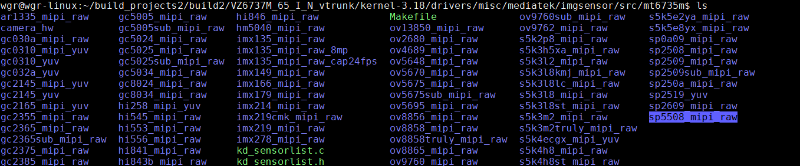
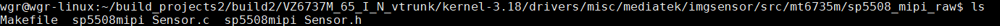
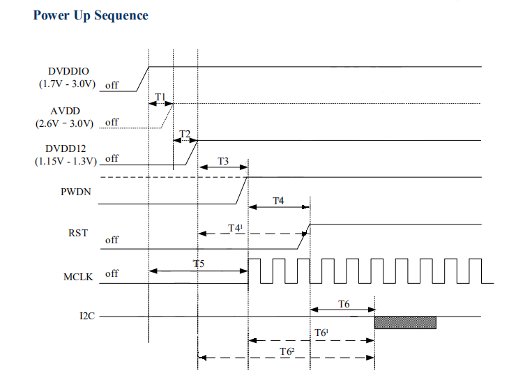
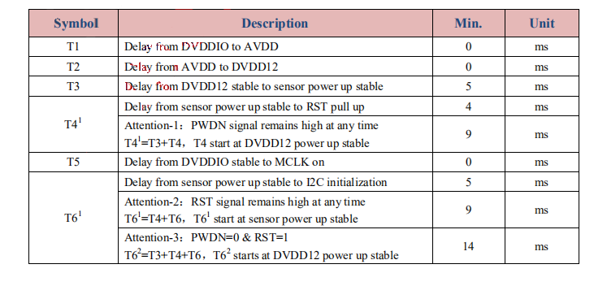
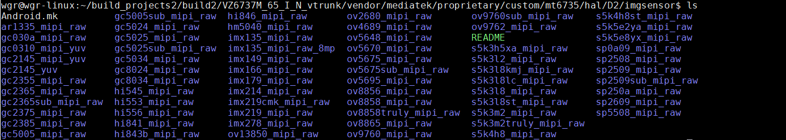
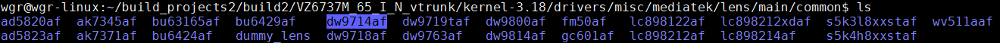
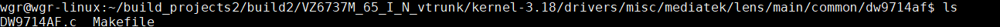
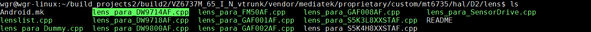

<!--
 * @Author: WangGuanran
 * @Email: wangguanran@vanzotec.com
 * @Date: 2020-03-08 11:26:22
 * @LastEditTime: 2020-03-08 17:17:22
 * @LastEditors: WangGuanran
 * @Description: Mtk Camera Configuration
 * @FilePath: /docs/Linux/MediaTek/Camera/Configuration.md
 -->

# 简介

文档以Camera sp5508_mipi_raw 介绍驱动配置方法。其他Camera配置方式一致。

# Kernel层相关配置

## （一）相关宏配置

MTK平台Camera配置相关的宏有如下几个，分为Kernel层和Hal层的宏。Kernel层的宏主要是配置Camera驱动代码，Hal层包含摄像头的效果代码。**RAW**摄像头包含平台**ISP**部分，Hal层有效果代码，大多数**YUV**摄像头ISP在芯片内部完成，没有Hal层代码（具体参照厂家提供的代码，部分YUV Camera有Hal层代码）。

>RAW的原意就是“未经加工”。可以理解为：RAW图像就是CMOS或者CCD图像感应器将捕捉到的光源信号转化为数字信号的原始数据。RAW文件是一种记录了数码相机传感器的原始信息，同时记录了由相机拍摄所产生的一些元数据（Metadata，如ISO的设置、快门速度、光圈值、白平衡等）的文件。RAW是未经处理、也未经压缩的格式，可以把RAW概念化为“原始图像编码数据”或更形象的称为“数字底片”。RAW格式的全称是RAW Image Format，在编程中称之为原始。

>ISP(Image Signal Processor)即图像信号处理器，用于处理图像信号传感器输出的图像信号。

>YUV是编译true-color颜色空间（color space）的种类，Y'UV, YUV, YCbCr，YPbPr等专有名词都可以称为YUV，彼此有重叠。“Y”表示明亮度（Luminance或Luma），也就是灰阶值，“U”和“V”表示的则是色度（Chrominance或Chroma），作用是描述影像色彩及饱和度，用于指定像素的颜色。

```C
#IMGSENSOR  
CUSTOM_HAL_IMGSENSOR = sp5508_mipi_raw  
CUSTOM_HAL_MAIN_IMGSENSOR = sp5508_mipi_raw  
CUSTOM_HAL_MAIN_BACKUP_IMGSENSOR =  
CUSTOM_HAL_SUB_IMGSENSOR =
CUSTOM_HAL_SUB_BACKUP_IMGSENSOR =  
  
CUSTOM_KERNEL_IMGSENSOR = sp5508_mipi_raw
CUSTOM_KERNEL_MAIN_IMGSENSOR = sp5508_mipi_raw  
CUSTOM_KERNEL_MAIN_BACKUP_IMGSENSOR =  
CUSTOM_KERNEL_SUB_IMGSENSOR =
CUSTOM_KERNEL_SUB_BACKUP_IMGSENSOR =  
```

以下几个宏为Camera内置马达驱动的宏配置。Camera具体使用哪个马达驱动需咨询**FAE**
>[ 英文field application engineer的缩写，也叫现场技术支持工程师、售前售后服务工程师。]。

```C
CUSTOM_HAL_LENS = fm50af dummy_lens
CUSTOM_HAL_MAIN_LENS = fm50af
CUSTOM_HAL_MAIN_BACKUP_LENS =
CUSTOM_HAL_SUB_LENS = dummy_lens
CUSTOM_HAL_SUB_BACKUP_LENS =

CUSTOM_KERNEL_LENS = fm50af dummy_lens
CUSTOM_KERNEL_MAIN_LENS = fm50af
CUSTOM_KERNEL_MAIN_BACKUP_LENS =
CUSTOM_KERNEL_SUB_LENS = dummy_lens  
```

## （二）驱动配置

驱动文件存放在相应的Kernel目录下，安卓版本不同，Kernel版本有相应的区别，请自行确认平台。
当前MT6735m使用的为kernel-3.18，摄像头驱动对应的目录为drivers/misc/mediatek/imgsensor/。

>Android P 9.0 版（甜点代号名称为：Pie 派)  
Android O 8.0 版（甜点代号名称为：Oreo 奥力欧）  
Android N 7.0 版（甜点代号名称为：Nougat 牛轧糖）  
Android M 6.0 版（甜点代号名称为：Mashallow 棉花糖）  
Android L 5.0 版（甜点代号名称为：Lollipop 棒棒糖）  

### ①　添加Camera驱动文件

驱动添加路径:

* kernel-3.18/drivers/misc/mediatek/imgsensor/src/xxx(平台)  
* kernel-3.18/drivers/misc/mediatek/imgsensor/src/common  

确切的编译路径需根据./arch/arm/configs/xxx_defconfig中宏CONFIG_ARCH_XXX(如：CONFIG_ARCH_MT6735M)
宏CONFIG_MTK_PLATFORM="xxx"(如：CONFIG_MTK_PLATFORM="mt6735")参考编译的Makefile判断。  

以mt6735m平台为例，驱动目录为  

* kernel-3.18/drivers/misc/mediatek/imgsensor/src/mt6735m  

将sp5508_mipi_raw驱动添加至该目录下



sp5508_mipi_raw目录下包含三个文件，Makefile文件可以参照其他Camera驱动修改。



### ②　添加Camera至kdSensorList

Kdsensorlist为MTK平台Camera驱动列表。
类型ACDK_KD_SENSOR_INIT_FUNCTION_STRUCT定义位置在：inc/kd_imgsensor_define.h

```C
typedef struct {  
    MUINT32 SensorId; // Camera Sensor ID  
    MUINT8 drvname[32]; // Camera Sensor Name  
    MUINT32(*SensorInit)(PSENSOR_FUNCTION_STRUCT *pfFunc); // Init Function 
} ACDK_KD_SENSOR_INIT_FUNCTION_STRUCT, *PACDK_KD_SENSOR_INIT_FUNCTION_STRUC 
```

* 不同平台定义和声明的位置不同，以下列出常用平台的定义位置：
* 默认位置：kernel-xxx/drivers/misc/mediatek/imgsensor/

| 平台    | Kdsensorlist定义位置               | SensorID/Name      | SensorInitFunc声明位置             |
| :------ | :--------------------------------- | :----------------- | :--------------------------------- |
| MT6735M | src/mt6735m/kd_sensorlist.h        | inc/kd_imgsensor.h | src/mt6735m/kd_sensorlist.h        |
| MT6739  | src/mt6739/imgsensor_sensor_list.c | inc/kd_imgsensor.h | src/mt6739/imgsensor_sensor_list.h |

1.定义SensorID：一般SensorID同Camera型号，如sp5508的SensorID为0x5508

```#define SP5508MIPI_SENSOR_ID                    0x5508```

2.定义SensorName：SensorName需包含Camera型号、接口类型、图像类型。

```#define SENSOR_DRVNAME_SP5508_MIPI_RAW          "sp5508mipiraw"```

如：sp5508mipiraw

* sp5508 ：Camera型号
* Mipi：接口类型 （其他接口：Parallel 并口 ）
* Raw：图像类型	（其他类型:YUV）

3.添加SensorInit声明，确保声明与驱动文件内一致。

```UINT32 SP5508MIPISensorInit(PSENSOR_FUNCTION_STRUCT *pfFunc);```

4.在kdsensorlist中添加Camera相关信息：宏定义名称需要与Camera驱动文件夹名称一致且为大写；
```C
#if defined(SP5508_MIPI_RAW)  
 {SP5508MIPI_SENSOR_ID,SENSOR_DRVNAME_SP5508_MIPI_RAW,SP5508MIPISensorInit},
#endif  
```

### ③　添加Camera上电时序PowerOnList

MTK平台上电时序保存在PowerOnList中
默认位置：

* kernel-xxx/drivers/misc/mediatek/imgsensor/

| 平台    | PowerOnList定义位置                        | 结构体类型             | 结构体类型定义位置                         |
| :------ | :----------------------------------------- | :--------------------- | :----------------------------------------- |
| MT6735M | src/mt6735m/camera_hw/kd_camera_hw.c       | PowerUp                | src/mt6735m/camera_hw/kd_camera_hw.h       |
| MT6739  | src/mt6739/camera_hw/imgsensor_cfg_table.c | IMGSENSOR_HW_POWER_SEQ | src/mt6739/camera_hw/imgsensor_cfg_table.h |

以下是MT6735M平台的结构体定义，其他平台定义虽然不同也只是对类型的再次封装和重定义。

```C
typedef struct {  
    PowerType PowerType;  
    Voltage Voltage;  
    u32 Delay;  
} PowerInformation;  
  
typedef struct {  
    char *SensorName;  
    PowerInformation PowerInfo[12];  
} PowerSequence;  
  
typedef struct {  
    PowerSequence PowerSeq[16];  
} PowerUp;  
```

* 枚举类型PowerType定义了Camera相关pin脚；
* 枚举类型Voltage定义了指定的上电电压；

按照如下格式定义Camera的上电时序，上电时序需要根据Camera的datasheet(规格书)，调整具体的上电顺序、电压，等待时间（ms），以下是Camera sp5508_mipi_raw的上电时序：

```C
#if defined(SP5508_MIPI_RAW)  
      {SENSOR_DRVNAME_SP5508_MIPI_RAW,  
      {  
       {PDN, Vol_Low, 5},  
       {RST, Vol_Low, 5},  
       {DOVDD, Vol_1800, 10},  
       {DVDD, Vol_1500, 10},  
       {AVDD, Vol_2800, 10},  
       {SensorMCLK, Vol_High, 10},  
       {PDN, Vol_High, 5},  
       {RST, Vol_High, 5}  
       },  
      },  
#endif  
```

Camera的datasheet会包含 Power On/Off Sequence 即上电/下电时序



以sp5508为例，在给DOVDD、AVDD、DVDD上电之前一般需要保证PWDN、RST置于初始状态（不同Camera要求有所不同，高/低电平都有可能），sp5508要求为先置为低电平，所以首先拉低PWDN、RST。
然后按照上电时序图依次拉高对应的Pin脚。部分摄像头还会要求开始即启动SensorMclk,具体情况再作相应的调整，同时Datasheet中还会包含具体的延时要求，如sp5508中：



延时是为了确保相应的Pin脚稳定，时序顺序正确才能保证Camera正常运行。

## （三）编译验证

至此Kernel部分的所有的Camera驱动配置完成，编译bootimage验证。解决驱动中或配置中的相关报错问题。Bootimage编译成功后，可以先至MTK编译目录中查看是否有相应的Camera驱动文件生成。
MTK平台目标文件生成路径为out/target/product/xxx/


有相应的Camera驱动文件生成下一步即将boot image刷进设备验证Camera是否配置成功。
Camera通信不成功需要先检查上电时序是否符合Datasheet要求，或者检查Camera I2C地址是否正确等，此文档只作相关的配置介绍，Camera通信问题这里不作赘述。

# Hal层相关配置

RAW摄像头芯片内部不作ISP处理，所有的图像处理均由平台完成，包含Hal层代码。
大多数YUV摄像头芯片内部已完成ISP部分的处理，不需要配置HAL层代码。

## （一）驱动配置

### ①　添加Camera效果代码

驱动添加路径：

* vendor/mediatek/proprietary/custom/xxx/hal/imgsensor/



* 不同平台具体文件路径可能存在差异，可自行根据Android.mk判断具体的添加路径。
* 此目录下Camera的目录名需要跟Kernel层下驱动的目录名称保持一致。

### ②　添加Camera至Hal层SensorList

SensorList为MTK平台Hal层Camera列表，保存位置为：

* vendor/mediatek/proprietary/custom/xxx/hal/imgsensor_src/sensorlist.cpp

其定义为：

```C
typedef struct  
{  
    MUINT32 SensorId;  
    MUINT8  drvname[32];  
    NSFeature::SensorInfoBase* pSensorInfo;  
    NSFeature::SensorInfoBase* (*pfGetSensorInfoInstance)();  
    MUINT32 (*getCameraDefault)(CAMERA_DATA_TYPE_ENUM CameraDataType, MVOID *pDataBuf MUINT32 size);  
    MUINT32 (*getCameraCalData)(MUINT32* pGetCalData);  
    MUINT32 (*getCameraFlickerPara)(MINT32 sensorMode, MVOID *pDataBuf);  
} MSDK_SENSOR_INIT_FUNCTION_STRUCT, *PMSDK_SENSOR_INIT_FUNCTION_STRUCT;  
```

在Sensorlist中添加如下信息，Raw摄像头使用RAW_INFO填充，Yuv摄像头使用YUV_INFO填充。RAW_INFO、YUV_INFO为两个宏定义，定义位置在同一文件内，可自行查找。

```C
#if defined(SP5508_MIPI_RAW)  
    RAW_INFO(SP5508MIPI_SENSOR_ID, SENSOR_DRVNAME_SP5508_MIPI_RAW, NULL),  
#endif  
```

此处SP5508MIPI_SENSOR_ID、SENSOR_DRVNAME_SP5508_MIPI_RAW均为Kernel层头文件内定义，以及定义顺序都需保持一致。

### ③　添加Camera马达驱动

若Camera可以进行自动对焦则需要配置马达驱动，没有可以直接跳过。
判断是否包含对焦马达：

* 查看Camera模组内透镜是否可以旋转，可以旋转即包含对焦马达；
* 咨询厂家FAE确认。

以dm9714af马达驱动为例：

Kernel驱动添加路径：

* kernel-xxx/drivers/misc/mediatek/lens/

1. 添加马达驱动代码
该目录下包含main，mian2，sub文件夹，分别放置不同摄像头的马达驱动。


以Camera作后摄为例，代码应放在main目录之下

* kernel-xxx/drivers/misc/mediatek/lens/main/common/


dw9714af目录下包含两个文件：马达驱动文件和Makefile文件，Makefile参考其他马达驱动配置即可。


1. 配置Kconfig
配置文件路径：

* kernel-xxx/drivers/misc/mediatek/lens/Kconfig

```C
config MTK_LENS_DW9714AF_SUPPORT  
  bool "DW9714AF Lens Driver"  
  default n  
  help  
    DW9714AF Lens Driver  
    This config is used to enable the corresponding  
    lens driver for the camera sensor module  
    Set as y if the driver is used in this project  
```

3. 配置Makefile
配置文件路径：

* kernel-xxx/drivers/misc/mediatek/lens/main/Makefile

```C
ifeq ($(CONFIG_MTK_LENS_DW9714AF_SUPPORT),y)  
MAIN_CFILES += common/dw9714af/DW9714AF.c  
endif  
  
obj-$(CONFIG_MTK_LENS_DW9714AF_SUPPORT)    += common/dw9714af/  
```

参考其他驱动文件配置即可。
4. 定义LensName
定义文件路径：

* kernel-xxx/drivers/misc/mediatek/lens/main/inc/lens_info.h

```#define AFDRV_DW9714AF "DW9714AF"```

5. 定义相关宏、声明函数

文件路径：

* kernel-xxx/drivers/misc/mediatek/lens/main/inc/lens_list.h

```C
#ifdef CONFIG_MTK_LENS_DW9714AF_SUPPORT  
#define DW9714AF_SetI2Cclient DW9714AF_SetI2Cclient_Main  
#define DW9714AF_Ioctl DW9714AF_Ioctl_Main  
#define DW9714AF_Release DW9714AF_Release_Main  
extern void DW9714AF_SetI2Cclient(struct i2c_client *pstAF_I2Cclient, spinlock_t *pAF_SpinLock,int *pAF_Opened);  
extern long DW9714AF_Ioctl(struct file *a_pstFile, unsigned int a_u4Command, unsigned long a_u4Param);  
extern int DW9714AF_Release(struct inode *a_pstInode, struct file *a_pstFile);  
#endif  
```

参考其他马达驱动配置即可。

6. 添加Lens至g_stAF_DrvList

g_stAF_DrvList类型为stAF_DrvList，定义位置在

* kernel-xxx/drivers/misc/mediatek/lens/main/inc/lens_info.h

```C
/* Structures */  
typedef struct {  
    u8 uEnable;  
    u8 uDrvName[32];  
    void (*pAF_SetI2Cclient)(struct i2c_client *pstAF_I2Cclient, spinlock_t *pAF_SpinLock, int *pAF_Opened);  
    long (*pAF_Ioctl)(struct file *a_pstFile, unsigned int a_u4Command,unsigned long a_u4Param);  
    int (*pAF_Release)(struct inode *a_pstInode, struct file *a_pstFile);  
} stAF_DrvList;  
```

在结构体数组中添加如下代码：

```C
#ifdef CONFIG_MTK_LENS_DW9714AF_SUPPORT  
   {1,AFDRV_DW9714AF,DW9714AF_SetI2Cclient,DW9714AF_Ioctl,DW9714AF_Release},  
#endif  
```

注：其他前摄，副后摄的马达驱动添加方法与主后摄一致，可以参考添加。

Hal马达效果代码添加路径：

* vendor/mediatek/proprietary/custom/xxx/hal/lens/

1. 将对应的马达效果代码添加至该目录下；


2. Android.mk添加如下编译指令；

```LOCAL_SRC_FILES += lens_para_DW9714AF.cpp```

3. 在lenslist.cpp中添加如下声明信息；

```C
#if defined(DW9714AF)  
extern PFUNC_GETLENSDEFAULT pDW9714AF_getDefaultData;  
#endif  
```

4. 添加LENS_ID，路径

* vendor/mediatek/proprietary/custom/xxx/hal/inc/camera_custom_lens.h

```#define DW9714AF_LENS_ID                     0x9714```

### ④　添加Camera至LensList

驱动添加路径在：

* vendor/mediatek/proprietary/custom/xxx/hal/lens/lenslist.cpp

该文件中包含LensList_main、LensList_main2、LensList_sub三个lenslist结构体数组，其定义为：

```C
typedef struct  
{  
    UINT32 SensorId;  
    UINT32 LensId;  
    UINT8  LensDrvName[32];  
    UINT32 (*getLensDefault)(VOID *pDataBuf, UINT32 size);  
  
} MSDK_LENS_INIT_FUNCTION_STRUCT, *PMSDK_LENS_INIT_FUNCTION_STRUCT;  
```

在驱动宏配置中Camera配置在哪个宏上边，此处就添加在哪个lenslist中，如：sp5508配置在CUSTOM_KERNEL_MAIN_IMGSENSOR中，则只需要添加在LensList_main中即可。
Camera sp5508对应的马达驱动为fm50af，故配置信息如下：

```C
#if defined(FM50AF)  
    {DUMMY_SENSOR_ID, FM50AF_LENS_ID, "FM50AF", pFM50AF_getDefaultData},  
    {SP5508MIPI_SENSOR_ID,FM50AF_LENS_ID, "FM50AF", pFM50AF_getDefaultData},
#endif  
```

## （二）编译验证

至此所有Hal层代码配置完毕，此部分代码需要编译库文件libcameracustom。同Kernel层的验证步骤一致，首先确认是否生成该库，如包含马达驱动，确认相应的驱动有被编到，最后开机确认功能效果，遇到其他问题具体问题再作分析。

# Revision history

| 版本 | 修改时间       | 修改人 | 修改备注                 |
| :--- | :------------- | :----- | :----------------------- |
| V1.0 | 2019年08月06日 | 王冠然 | Init Version             |
| V1.1 | 2019年08月08日 | 王冠然 | 添加马达驱动Kernel层配置 |
| V1.2 | 2019年08月10日 | 王冠然 | 处理图片以及代码背景水印 |
| V1.3 | 2019年08月10日 | 王冠然 | 补充39平台上电时序位置   |
